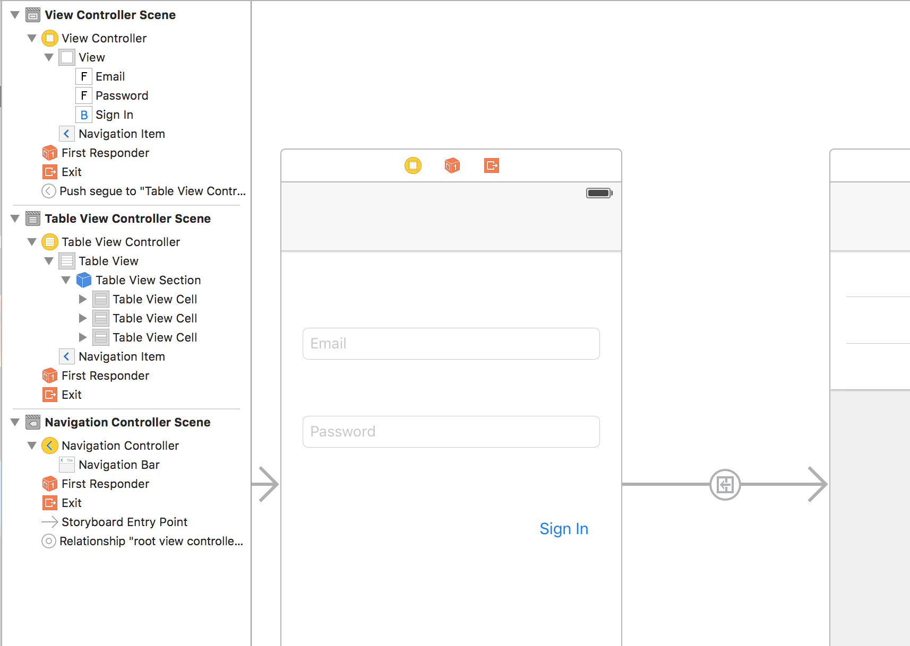
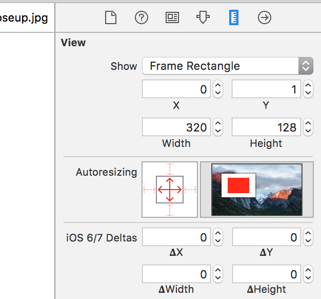

#  iOS Development 101

### LEARNING OBJECTIVES
*After this lesson, you will be able to:*
- Explain relevant history and trends in iOS development.
- Identify key skills leveraged by iOS developers.
- Survey the common tools used within the iOS ecosystem.
- Apply key concepts and skills to build your own basic iOS application.
- Create a custom learning plan to help you continue to build fundamental iOS development skills after this workshop.

### STUDENT PRE-WORK
*Before this lesson, you should already be able to:*
* Bring a Mac laptop (*required*) and iOS testing device (*optional*).
- Upgrade your OS to the latest version.
- Download and install the latest version of [Xcode](https://developer.apple.com/xcode/).

### INSTRUCTOR PREP
*Before this lesson, instructors will need to:*
- Review & modify lesson plan & [slide deck](Slides.pdf) as needed
- Write learning objectives & relevant information on board

### WORKSHOP AGENDA
| TIMING  | TYPE  | TOPIC  |
|:-:|---|---|
| 10 min  | [Opening](#opening)  | Greetings + The GA Experience  |
| 15 min  | [Introduction](#intro1)   | Discuss history & scope of iOS development |
| 15 min  | [Demo](#demo1)  | Visualize the iOS ecosystem  |
| 20 min  | [Guided Practice](#guided-practice1)  | Navigate your iOS environment |
| 20 min  | [Independent Practice](#ind-practice1)  | "Test" your iOS skills |
| 5-10 min  | BREAK  |   |
| 15 min  | [Introduction](#intro2)   | iOS Fundamentals: What Do You Need to Know?  |
| 15 min  | [Demo](#demo2)  | Foundational Concepts in Your Xcode IDE |
| 20 min  | [Guided Practice](#guided-practice2)  | Practice iOS Fundamentals |
| 20 min  | [Independent Practice](#ind-practice2)  | Apply iOS Fundamentals |
| 10 min  | [Conclusion](#conclusion) | Review + Recap |
| 10 min  | [Takeaways](#takeaway) | Learning Plan, Q&A |

---

<a name="opening"></a>
## Opening (# mins)

> Note: Let people know where restrooms and kitchen are located, as needed.

#### Instructor Bio

Welcome to iOS Development 101! Here's a bit about me:

> Provide your name and brief bio, including: your background in iOS development, any experience you've had with GA, and one "fun fact" about yourself.

#### Introduce Yourselves

Before we dive in, a bit about you!

> Have students introduce themselves: name, what brings them to GA (ask for their current career & any specific goals), & one "fun fact".

> **Example Exercise**: *Have students submit this information in a format easily accessible so you can input information into a demo/dummy app that describes the class.*

> **Alternate Exercise**: *Have students share their information in pairs/groups and have other pairs/group members recite this information back to the class.*


#### Our Expectations

- You're ready to take charge of your learning experience.
- You have a Mac laptop and *optional* testing device.
- You've downloaded and installed the latest version of [Xcode](#).
- You're curious and excited about iOS development!

#### Our Objectives

> Note: Write workshop objectives on board before class

- Why this topic matters (general relevance)
- Why this topic rocks (interest/hook)

> Note: Tailor these 2 points to student interests. Relate to their career info & goals students described during attendance.


***

<a name="intro1"></a>
## Introduction: History & Scope of iOS Development (15 mins)

### What is iOS?

iOS is the operating system that powers the iPhone and iPad. It's based on a set of frameworks and programming languages that power all of Apple's devices, including Macs and Macbooks (macOS, or until recently, Mac OS X), the Apple TV (tvOS), and the Apple Watch (watchOS). Learning iOS is a great starting point for gaining access to the rest of Apple's device ecosystem, and as Apple continues to standardize the frameworks that power these devices, the easier it is to build for all of them simultaneously by sharing code.

iOS stems from a long history of Apple development for Mac. The most notable technology is Objective-C, a 30-year old programming language that still exists as a viable language for building apps for iOS and Mac. However, _Swift_ is the new language of choice for Apple development, being more approachable than Objective-C. It's a great way to build apps as well as learn programming if you're new to code.

Here's a brief comparison of the two languages that defines attributes of a user in both Objective-C and Swift.

Objective-C:

```
@interface User : NSObject {
    NSString* firstName;
    NSString* lastName;
}
@property (retain) NSString* firstName;
@property (retain) NSString* lastName;
@end


@implementation User

@synthesize firstName;
@synthesize lastName;

- (void) dealloc
{
    [firstName release];
    [lastName release];
    [super dealloc];
}

@end
```

The same code written in Swift:

```
class User {
    var firstName : String
    var lastName : String
}
```

Much shorter and more readable!

> Check: Have a student articulate the benefits of Swift. Then, have students predict why is also good to know Objective-C as a new iOS Developer. (For working on legacy apps.)

***

<a name="demo1"></a>
## Demo: Visualizing the iOS Ecosystem (15 mins)

### Xcode

Xcode is an integrated development environment (or IDE) made available to every Mac owner and contains nearly all of the tools necessary for building apps for iOS. It's essentially an app that contains all the tools for building apps.

It is a combination of tools that work together (hence, "integrated") in a single place (hence, "environment") for developing apps and programs. By using Xcode, you can learn Swift, develop projects that work on any Apple device, and simulate those apps without having to own a mobile device, Apple watch, or Apple TV.

Those tools integrated into Xcode consist of a code editor, "Playgrounds," Interface Builder, an iOS device simulator (or just, "simulator"), a debugging suite, and other various tools that help with editing various files that comprise an app (property lists, data schemas, etc.).

Along with Xcode, developers often use other third-party tools for testing and building various components that go into apps (like icons). Other popular tools exist that enable us to easily incorporate other developers' code to simplify our iOS development.

### The Ecosystem

Before we start diving into building iOS apps, there are some concepts we have to introduce.

The "operating system" is the software that provides the environment in which our apps live. This is iOS, which is analogous to Windows, Linux, or Android, but runs exclusively on Apple's mobile devices. It "talks" to the hardware, so we don't have to worry about the peculiarities of running on a particular device.

"Frameworks" are code that Apple provides that standardize the interaction between our apps and the operating system and device. For example, the "UIKit" framework provides user interface elements like buttons, toolbars, and tables that comprise user interfaces. It means we don't have to worry about writing code that draws typical elements, and it provides a consistent look-and-feel between apps.

Once you start working with code, you'll take advantage of third-party frameworks (also called "libraries" or "packages") written by other iOS developers that will make your life easier. For example, one library called `SDWebImage` is used to load images from the Internet asynchronously (so the UI doesn't stall), and cache them on the device (so you only have to download them once).

### Parts of an App

Xcode enables you to develop almost any aspect of an app in one place. Here are the things that we're going to need to know to be effective with building apps:

**User Interfaces.** Interface Builder enables you to build UIs for apps in a kind of visual flowchart. In fact, Xcode's Interface Builder is so robust, that you can prototype entire apps and run them on your iPhone without needing to write a single line of code! You can drag-and-drop interface components onto screens that will adapt to the user's device size and its orientation. Also, Xcode has features that present code and UI side-by-side, so you can work with them together conveniently.

**Code.** Xcode naturally gives you the ability to write code, but its integrated nature means it "understands" the code much more than a basic text editor would. This means you can reference Apple's documentation, jump to places where functions or classes are defined, and even get suggestions on what to write next, all from Xcode itself. When you're writing code, you might want to try something out before committing it to the app itself, so Xcode provides _Playgrounds,_ interactive environments that evaluate Swift code in real time.

**Tests.** Learning to write tests (code that ensures your code runs correctly) is a major step in becoming a professional app developer. Xcode provides facilities to help you automatically build your app. Tests enable you to make changes with confidence. _And don't let anyone convince you that "moving faster" is more important!_ Writing tests empowers you to move faster, because you won't have to fix all the bugs that will result from changing untested code!

**Assets.** These are all the media files that you need to make an app look professional and consumable by customers. This includes icons, videos, graphics, etc. Xcode puts them into a Media Library so you can access them from any part of the app.

In this course, we'll introduce you to building a simple app with Interface Builder and running it in the simulator (or on your device, if you so choose). This will enable you to deploy app prototypes on your phone and demonstrate them to others. We'll also give you some resources to continue your learning and dive into powering that app with actual Swift code.

> Check: Have students turn to the person next to them and discuss, in their own words, how XCode relates to the different parts of the app outlined above.

***

<a name="guided-practice1"></a>
## Guided Practice: Navigating your Xcode environment (15 mins)

> Instructor Note: Have students open Xcode with you and make sure students are seeing the same thing you are displaying. Quickly show the different parts of the platform and then ask the to follow along as you do the following steps.

### Xcode Projects

#### Create an Xcode Project

An Xcode "project" contains everything needed to make one or more related apps. If you're building for iPhone, iPad, Apple TV, and a Mac, you can share code between those apps and deploy them to Apple's App Stores all from Xcode.

The typical steps to create new project:

1. Open Xcode and go to File > New > Project.
2. You'll be asked to pick a template. We're going to start with `iOS > Application > Single View Application`. This will be the most common template you'll use. The others may provide some early convenience, but most developers don't bother.
3. Give the project a name.
4. Specify an "Organization Name." If you don't have a company you're building this app for, think of it as a company or brand you would make for your apps.
5. There are several checkboxes below for Core Data and test suites. Leave them unchecked for now.
6. Finally, specify a place to save the folder into which all the project files will go. You can also leave "Create a Git Repository" unchecked.


#### What's in an Xcode project?

There are four file types that come with an Xcode project.

- `.swift` files, which contain app logic written in Swift.
- `.storyboard` files, which will hold user interfaces (Scenes, text labels, labels, images, etc.).
- `.xib` files, which hold individual, custom UI views.
- `.plist` files, which are used for configuration.

The last file type, Property Lists (.plist files), are a special kind of data file that can hold various pieces of information needed to configure an app, like the app's version, native language, the name of the actual executable file that will be installed on a user's iPhone, etc. We won't often have to edit these files, but they do come in handy.


### Introduction to Interface Builder

#### What are Storyboards?

Storyboards are a mechanism that enables you to compose multiple Scenes, the transitions between them, and their respective Views in a single place.

Sitemaps that web designers draw show the structure of the site and describe the "flow" from one page to another. Storyboards are like this. It shows various screens of the app (called "Scenes"), and how one flows to into the next. Each line of flow (transition) from one Scene to the another is called a "Segue."

#### First, disable Auto Layout.

Auto Layout is the modern way of building responsive interfaces for iOS. That means that you can declare rules for how the app should adapt a user interface for multiple devices, like an iPhone SE, iPhone 6S, iPad, etc., without having to build a separate Storyboard for each device.

Auto Layout is quite complicated and delicate. It gives you a lot of power as an app developer, but it hours of practice to gain the basics (and even longer to master). We're going to avoid it for now by using the "old school" method of automated layout called "Springs-and-Struts."

To disable Auto Layout:

- Click on the View Controller.
- In the Inspector panel on the right, click on the first icon, the File Inspector.
- Near the middle of the panel, uncheck "Use Auto Layout."
- Xcode will prompt you to disable "Size classes." We can't use them with Springs-and-Struts, so just go ahead and click "Disable Size Classes."

"Size classes" are a mechanism in Auto Layout that help you distinguish between classes of devices, like tall narrow screens, like for iPhone SE and 6S, or large, wider screens, like the iPad in landscape mode. When using Auto Layout, this enables you to manipulate the view layouts according to which class of device you're designing for. Here, however, we won't be using Auto Layout, so we don't need size classes.

#### View Controllers + Scenes

View Controllers manage Views and generally represent one "Scene" of an app. We can attach a bunch of code to a View Controller. That’s where the "logic" for an app generally lives.

### What are views?

To start learning how to build iOS apps, we’ll first tackle "views." Nearly every UI element we see in an app is a View. Buttons, labels, tables, images, etc.

A _View_ is a renderable element that has a size, has rules about how to draw and interact with it, and can contain other Views. A Button, for example, is tappable and can be rendered as text or an image. A Collection View, like the one in the Photos app, contains many square Image Views. Every View Controller by default has a single, empty View into which you add your own Views.

## Guided Practice: Analyze an App's User Interface

In pairs, at the whiteboards, open an app that you both know (like Instagram or Facebook) and break down the UI by the Views you see:

- Draw a "wireframe" (just outlines) of the Scene you're interested in.
- Label each "View" as you see it (e.g. label, text view, image, etc.).
- Use the IB Library as your catalog of possible views.

Present the wireframes to the rest of the class. Speculate with other class members different ways the Scene could have been constructed.

> Instructor Note: There is a slide of available views extracted from the Library available in the slide deck. Although this is iOS 9, it may provide a good guide for students.

## Individual Practice: Composing Views

You'll build UIs by composing Views onto a Scene represented by a View Controller. In the Interface Builder Library, you'll find a number of prebuilt Views that come with the UIKit framework.

Let's start by adding a simple text field to the View Controller shown in the Main.storyboard file. In the Library, search for "text field" using the search bar at the bottom. Drag it from the Library onto the middle of the View Controller. You can reposition it by click-and-dragging it around, then resize it by dragging the two handles at either end.

When you click the text field, the sidebar on the right, the Inspector, will show attributes of the selected View. First, click on the Attributes Inspector, 4th from the left. Change the value in the Attribute called "Placeholder" to "Email," which is the placeholder text for the text field. This will show when the text field is empty, cueing the user to what to put there.

Now let's run your app in the simulator! Click the play button in the upper left of the Xcode window. The first time, it will take a while, since the Simulator has to start, and Xcode has to install iOS onto the simulator. What you're doing is starting up a virtual device, a virtual iPhone on your Mac that will act just like your own. You can't install apps on in from the App Store, but you can install your own apps just by pressing the Play button.

When the simulator starts, try the following:

- Click (tap) on the text field. A keyboard should appear, just like on an iPhone.
- Type on the keyboard by tapping its buttons.

This is how we'll build user interfaces. We'll add more Views, customize them, test them in the Simulator, and repeat. This way, you'll be able to see your entire app (or most of it), without having to write any code. Then at the end of the lesson, we'll make multiple Scenes and connect them together.

> Check: Were students able to compile and launch the app? Were they able to click on the text field according to the direction above?

***

<a name="ind-practice1"></a>
## Practice in Pairs: "Test" your user interface skills (20 mins)

Change the keyboard of the text field to an email entry.

Add another text field to the view controller below the initial on. Add placeholder text that says, "Password". In the text field's properties, check the box that says "Secure text entry" in order to conceal the characters the user will type.

Find a button in the UI library and add it below the password field. Double-click it to change its text to "Sign In".

Run the app in the iOS simulator. Verify that the top text field, when tapped, shows a keyboard that has an "@" symbol. Also verify that the password entry field obfuscates any typed characters.

> Check: See that each student was able to change the keyboard type and verify that it works in the simulator.

***

> **BREAK**

***

<a name="intro2"></a>
## Introduction: App Fundamentals (15 mins)

Putting an app together requires a variety of tools and processes. We have to design and build user interfaces, write code to power those user interfaces, write business logic (in Swift) to manipulate user data, connect to outside services like Google Maps or Yelp, and find ways to store users' data either on the device or on the cloud.

When we write code, Xcode provides facilities for us to test and prototype components of code that we write. They're called "Playgrounds," and they're one of the advantages of using Swift. They enable us to write code using Apple's frameworks, work with it interactively, then incorporate that code into our apps. It vastly cuts down on the time to learn and write Swift by giving us dynamic and interactive feedback.

> Instructor Note: You can take this opportunity to demonstrate a Playground. The students can follow along if you deem it useful. Writing simple arithmetic expressions that aren't too Swift-specific might be the best route. Point out that the answers on the right are displayed right next to the expressions that produce them.

To build user interfaces, we typically use Storyboards that contain more than one View Controller. Once you learn the basics, you'll be able to prototype entire apps and present them on your phone.

***

<a name="demo2"></a>
## Demo: App Fundamentals: Storyboards (15 mins)

### Navigation Controllers

Navigation Controllers manage View Controllers. A Navigation Controller decides which View Controller to display at any given moment, and it also keeps track of the ones that it has displayed previously and in which order. Think of it like how a web browser keeps track of history.

There are a couple of terms we need to introduce to understand what's going on in the Storyboard when we introduce a Navigation Controller:

* Initial View Controller - The first View Controller an app will display when launching.
* Root View Controller - The first View Controller that a Navigation Controller will show.

There are a couple of ways to add a Navigation Controller, but we'll use one that makes it easy to get started:

1. Select the View Controller in Interface Builder.
2. Go to the menu item `Editor > Embed In > Navigation Controller`.
3. Notice how the IB canvas shows another box labeled "Navigation Controller," which points to your original View Controller.

### Segues

Segues are animated transitions between two View Controllers. The Source View Controller renders the scene a user sees before the Segue, and the Destination View Controller is the one the UI will render afterwards. There are several types that determine how a View Controller is "presented" to the user.

For example, when a user taps on the "Sign In" button, we would want first to check the user's password (which we won't do this time), then if the password is correct, have the current scene "segue" to the home scene of the app.

### Creating a Segue

The Navigation Controller gives your app the ability to use Segues. Here's how to add that next Scene to your app and Segue to it:

1. Drag a UITableViewController to the canvas, just to the right of the login scene.
2. Press CTRL and click-and-drag from the "Sign In" button to the UITableViewController.
3. You should see a blue line and when you hover over the table, it should highlight.
4. Let go of the mouse button. A small dark menu should appear. This is asking you what kind of Segue it should create for you.
5. Click on "Push."
6. Run your app!

Now, when the app loads, you should see a Navigation Bar at the top, and when you click on the "Sign In" button, it should segue to the table, which slides in from the right.

Note how the table view controller shows a "Back" button at the top. This is one of the conveniences that the Navigation Controller offers. Let's explore a bit how this works:

1. Go back to Interface Builder.
2. Click on the original Scene you made, which we'll call the "Login View Controller."
3. Double-click in the middle of the Navigation Bar at the top.
4. When the editor appears, type "Login".
5. Run your app.

Now when you tap "Sign In," the back button now says "Login," reflecting the title of the previous (i.e. Source) View Controller. The Navigation Controller "knows" which View Controllers it has shown to the user. Later, you'll be able to use this fact (leveraging Swift, of course) to pass data between the View Controllers, like the user's email address.

***

<a name="guided-practice2"></a>
## Guided Practice: App Fundamentals: Media and Tables (20 mins)

We're going to investigate one of the most common design patterns in iOS, the master/detail view. A master view is a list of a set of items, like the view of tweets in the Twitter app. The detail view is a whole-screen view that shows _details_ about a selected item from the master list.

To do this, we're going to create a catalog of objects (like a list of dogs), introduce the process of importing media that you'll find in Google Image Search (or another source), then include the images in the project's media library.

> Have the students search for some catalog-able item, like dogs, cats, etc. The goal is to download 3 or 4 related images.

After downloading some images, put them in a folder. You can import them into your project simply by dragging the folder from Finder onto the sidebar in Xcode. You'll see a dialog box pop up with some options about how to enter them. For now, let's check "Copy Items if Needed" and select "Create Groups." We'll describe what these mean later.

Once the import is complete, the images will show up in the Media Library in the lower-right corner of Interface Builder. We're going to add these images to the rows in the table view, but first we have to learn a little about tables.

### Table Views

Table Views (or UITableViews) are one of the most important views in iOS. You see tables everywhere. Pretty much every task manager app uses a table view to show a list of tasks. The Twitter app, Instagram, Facebook, all use table views to display a linear list of entries. In addition to their ubiquity, they also use code patterns that relate to many other parts of UIKit.

Tables are composed of Table "Cells," each of which contains a generic, empty View by default. There are two ways you can specify the content of a cell, either "statically" or "dynamically."

"Static Cells" contain content that doesn't change, and that you can specify here in Interface Builder. "Dynamic Prototypes" are cells that define a template, which you can build here in IB, but must use code to populate with content.

Dynamic Prototypes are used most of the time. Apps like Twitter use them to show different layouts for different tweets. So why use static cells? There are some tables that don't change, like a settings panel. We're going to use static cells to show a catalog of things.

First, let's tell the table view that we want it to contain static cells. On the left of the Xcode window, find the Document Outline, which is a second sidebar only available in Interface Builder. This sidebar contains a list of all the View Controllers and Views in the Storyboard, arranged by hierarchy.



Expand the items under Table View Controller in the Document Outline by clicking on the small triangles. This is similar to the tree view in Finder. Keep expanding until you see the views "Table View" > "Table View Section" > "Table View Cell". This shows the View structure of that View Controller. You can select Views either from the canvas on the right, or, to be more accurate when Views are nested within each other, you can select them in the Document Outline.

Here's how to specify that the table should use static cells:

- Click on "Table View" in the Document Outline to select it
- Go to the Attributes Inspector as before.
- Under Content at the top, select "Static Cells" from the dropdown.
- You'll get the chance to select how many static cells you want to show. It defaults to 3.

### Adding Images

Now we're going to add the media you just imported to the cells to make a kind of "catalog."

- Select the first "Table View Cell" in the Document Outline.
- In the canvas, the cell should be selected, and you should a see a small handle at the bottom. Drag this to resize the cell if you want.
- Find an "Image View" in the IB Library.
- Drag an image view onto the cell in the canvas. Alternatively, you can drag it underneath the "Table View Cell" in the document outline.
- Resize the image view to your liking.
- With the image view selected, look at the Attributes Inspector on the right. At the top, select an image from the drop-down labeled Image. If you want to see the actual images, you can open the Media Library at the bottom of the sidebar.
- You'll see the image is probably stretched oddly. Under Mode, select either "Aspect Fit" or "Aspect Fill."
- Pick the image mode that looks best to you. Resize the cell and the image view to produce the layout you want.

Congratulations! You've just started building the master view of a master/detail design pattern!

Run your app. Now when you tap on "Sign In", the app should segue to the table and show your image.

### Springs-and-Struts

> This section may be optional if time is short. It's intended to demonstrate how to get a more accurate layout between Interface Builder and what's displayed in the app.

If you noticed, the Views you laid out in IB don't quite match what you see in the app itself when running in the simulator. There may be extra space around image or text views, or they might not be in their right places.

This is because IB is built to design _responsive_ layouts, that is, layouts that respond to different devices with different proportions. It's not possible to represent every possible device proportion simultaneously, so IB gives us something more generic and provides ways to express the rules around how to lay out these views.

The set of layout rules we're using is called "Springs-and-Struts." If you click on the Size Inspector while one of the text fields is selected in the Login View Controller, you'll see a section labeled "Autoresizing" with a black square, four clickable lines outside the square, and two double-arrows on the inside.



The lines on the outside are called "struts," and the inner arrows are "springs." If a spring is selected (red), it means that that dimension (either height or width) of the selected view is proportional to that dimension of the view that contains it.

If a "strut" is selected, it means that the margin is fixed, that is, _not_ proportional to the margin to the view that contains it.

For our purposes, we'll want to deselect all struts and select both of the springs. Give it a try and run your app. The views should be in a better place.

### More Segues!

We're going to add a "detail" view to the cell you've just populated. In a master/detail pattern, you have a list of items, and then detail views that contain, well, the _details_ about a single item. Just like in the Twitter app, tapping on a tweet shows a Scene that contains information about that single tweet.

Here's how to add a detail scene:

- From the Library, drag a new View Controller onto the canvas, just to the right of your Table View Controller. Position it into a convenient spot to the right.
- CTRL-click on the "Table View Cell" in the Document Outline. A black menu should appear.
- Next to the item called "selection" is a small circle. Click-and-drag from that circle onto the new View Controller.
- The same Segue selection menu should appear. Select "Push." Note how a navigation bar now appears at the top of the new View Controller.
- Add another Image View to the View Controller and select the same image as is in the cell. Remember to set your springs-and-struts and image mode!
- Run your app. When you tap on the cell, the app should segue to the new detail scene.


***

<a name="ind-practice2"></a>
## Independent Practice: Apply App Fundamentals (20 mins)

> This part of the exercise continues adding media to the table and adding View Controllers. This can also be an opportunity for students to explore other Views in the Library.

- Complete your catalog of images by adding an image to each cell in the table.
- If you want, add more cells to the table by clicking on "Table View Section" in the Document Outline and changing the number of rows.
- Add View Controllers for each table cell. Remember to add segues.
- If you're feeling ambitious, add a Label or Text View to the View Controller to describe the image. Remember to set your springs and struts!
- Run the app and test it.

> This section is intended to allow the students to get accustomed to working with Interface Builder. Walk around the classroom and answer any questions about views, etc.

***

<a name="conclusion"></a>
## Conclusion: Review + Recap Topics (10 mins)

> Review Deliverables
>
> Encourage some students to share their apps with the class.
> Distributed the [course handout](handout.pdf).

> Review topics to cover in a discussion format.

### Apps

- What components comprise an iOS app?
- What different file types are found in an iOS app?

### Tools

- What tools does Xcode provide and what do they enable you to do?

### User interfaces

- What is a Storyboard?
- What is a View? Name some examples of views provided by UIKit.


***

<a name="takeaway"></a>
## Takeways: Learning Plan + Q&A (15 mins)

#### What Should You Do Next?

- Check out the learning resources at [Apple's Developer Site][https://developer.apple.com].
- Download Apple's [Swift iBook](https://itunes.apple.com/us/book/swift-programming-language/id1002622538?mt=11).
- Watch videos from [WWDC](https://developer.apple.com/wwdc/).
- Read more about [new Apple technologies](https://developer.apple.com/develop/).
- Practice using Xcode to build app prototypes.
- Download sample graphics from [The Noun Project](http://thenounproject.com) to serve as icons for your sample apps.
- Download Prepo from the App Store to size media and import it into your app.
- Learn to link UI views to code via IBOutlets and IBActions.
- Learn more about [Apple mobile design](https://developer.apple.com/ios/human-interface-guidelines/).
- Read about [running your app on your device](https://developer.apple.com/library/mac/documentation/IDEs/Conceptual/AppDistributionGuide/LaunchingYourApponDevices/LaunchingYourApponDevices.html).


#### Q & A

***

## ADDITIONAL RESOURCES

- [a](#)
- [b](#)
- [c](#)
